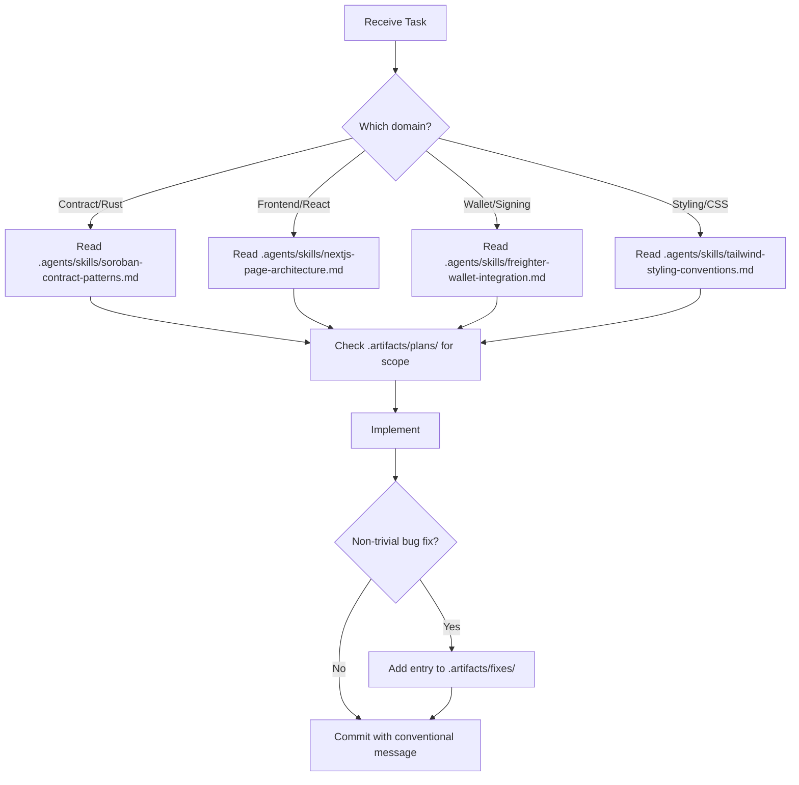

# AGENTS.md — INGAT

> Instructions for AI coding agents (Kiro, Claude Code, Cursor, Copilot, etc.) working in this repository.  
> **Read this before making changes.**

---

## Project Summary

**INGAT** (Income Guardianship & Allocation Tool) is a Stellar/Soroban remittance app for Overseas Filipino Workers (OFWs). Senders deposit stablecoin that a smart contract auto-splits into:

- **Spending Bucket** — freely withdrawable by the receiver at any time.
- **Goal Bucket** — locked on-chain until a sender-defined date.

Two roles only: **Sender** and **Receiver**. No admin/auditor role exists by design.

---

## Agent Architecture & Steering System

```
.kiro/steering/
├── product.md      # Business objectives, user personas, security principles
├── tech.md         # Technical stack: Stellar Testnet, 7-decimal precision, Freighter v2
└── structure.md    # Directory conventions, container/presentational separation

.agents/skills/
├── soroban-contract-patterns.md      # State leases, TTL extensions, time-sim tests
├── nextjs-page-architecture.md       # App Router rules, Client/Server split, hydration
├── freighter-wallet-integration.md   # getAddress(), signTransaction() API shapes
└── tailwind-styling-conventions.md   # Tailwind v4, @theme, glassmorphic utilities

.artifacts/
├── plans/          # Phase-by-phase build plans (all COMPLETE)
└── fixes/          # Non-trivial bug fix log for agent context
```

### Decision Flow for Agents



---

## Repository Layout

```
ingat/
├── apps/web/               # Next.js 16 App Router frontend (TS + Tailwind v4)
│   ├── app/                # Route pages (each renders one container)
│   ├── components/
│   │   ├── containers/     # State-aware — own hooks, compose UI components
│   │   └── ui/             # Presentational — props in, JSX out, no hooks
│   ├── hooks/              # React hooks for wallet, deposit, withdraw, balances
│   ├── lib/
│   │   ├── stellar/        # SDK client, contract wrappers, Freighter helpers
│   │   ├── validation/     # Form validation (split ratio, dates, addresses)
│   │   └── utils/          # Formatting, constants
│   ├── types/              # TypeScript interfaces
│   └── context/            # React context providers (WalletContext)
├── contracts/ingat-vault/  # Soroban smart contract (Rust)
│   ├── src/                # Contract logic (deposit, withdraw, split)
│   └── tests/              # Time-manipulation ledger tests
├── .agents/skills/         # Agent skill docs — read before implementing
├── .kiro/steering/         # Product/tech/structure steering
└── .artifacts/             # Plans and bug fix logs
```

---

## Commands

Run **all commands from the repo root** (npm workspace):

| Command | Description |
|---------|-------------|
| `npm install` | Install workspace dependencies |
| `npm run dev` | Next.js dev server (Turbopack) |
| `npm run build` | Production build with TypeScript check |
| `npm run lint` | ESLint check |
| `npm run contract:build` | Compile Soroban contract to WASM |
| `npm run contract:test` | Run Rust unit tests |
| `npm run contract:clean` | Clean Rust build artifacts |

> ⚠️ Do **not** `cd apps/web` for JS commands. The root workspace handles it.

---

## Non-Negotiable Conventions

### Frontend Architecture

| Rule | Detail |
|------|--------|
| Page = Container | Every `app/**/page.tsx` renders **exactly one** container component. No hooks/state/logic in page files. |
| Container/Presentational split | `components/containers/` owns state + hooks. `components/ui/` is props-only. |
| Stellar isolation | All chain interaction goes through `lib/stellar/`. Hooks call lib; components never call it directly. |
| Validation isolation | Validation lives in `lib/validation/`, never inline in form components. |

### Data & State

- **Contract is source of truth.** No backend database. No Supabase, Postgres, or off-chain stores.
- If a caching layer is ever proposed, flag it as a spec deviation.

### Roles

- Only Sender and Receiver flows. No admin/approver/auditor — out of scope by design.

### Styling

- Tailwind CSS v4 only. Warm, trustworthy, banking-app clarity. No neon/crypto aesthetics.
- Brand colors defined via `@theme` in `globals.css`: terracotta, sage, teal, amber, gold.

---

## Before Writing Code

1. **Check `.artifacts/plans/`** for current phase scope (all phases are COMPLETE).
2. **Check `.kiro/steering/`** for product/tech context when uncertain.
3. **Run `npx tsc --noEmit`** before committing to catch type errors.
4. **Never use any type in the frontend.**  
5. **Never use any state in the frontend.**

## After Fixing a Non-Trivial Bug

Add a short entry to `.artifacts/fixes/` with: what broke, root cause, the fix. A few lines max.

---

## Explicit Out-of-Scope

Do not build unless explicitly asked:

- ❌ Mobile app / React Native
- ❌ Multi-sig or approver role
- ❌ Emergency bucket (only Spending + Goal exist)
- ❌ KYC flows
- ❌ Off-chain database of any kind
- ❌ Notifications (email/SMS/push)
- ❌ Token swap or DEX integration

---

## Git & Commit Conventions

- Commit after every completed task
- Use **conventional commits**: `feat:`, `fix:`, `docs:`, `style:`, `test:`, `chore:`
- Keep messages short, descriptive, and imperative mood
- Do not push directly to `main` without confirmation
- Stage specific files — avoid `git add .`

---

## Engineering Plans (Status)

| Phase | Description | Status |
|-------|-------------|--------|
| 1 | Contract Core — Soroban logic, Cargo workspace, tests | ✅ Complete |
| 2 | Wallet & Sender Flow — connection, hooks, deposit form | ✅ Complete |
| 3 | Receiver Flow — bucket cards, unlock timers, withdrawals | ✅ Complete |
| 4 | Polish & Demo — type checks, build, clean layouts | ✅ Complete |
