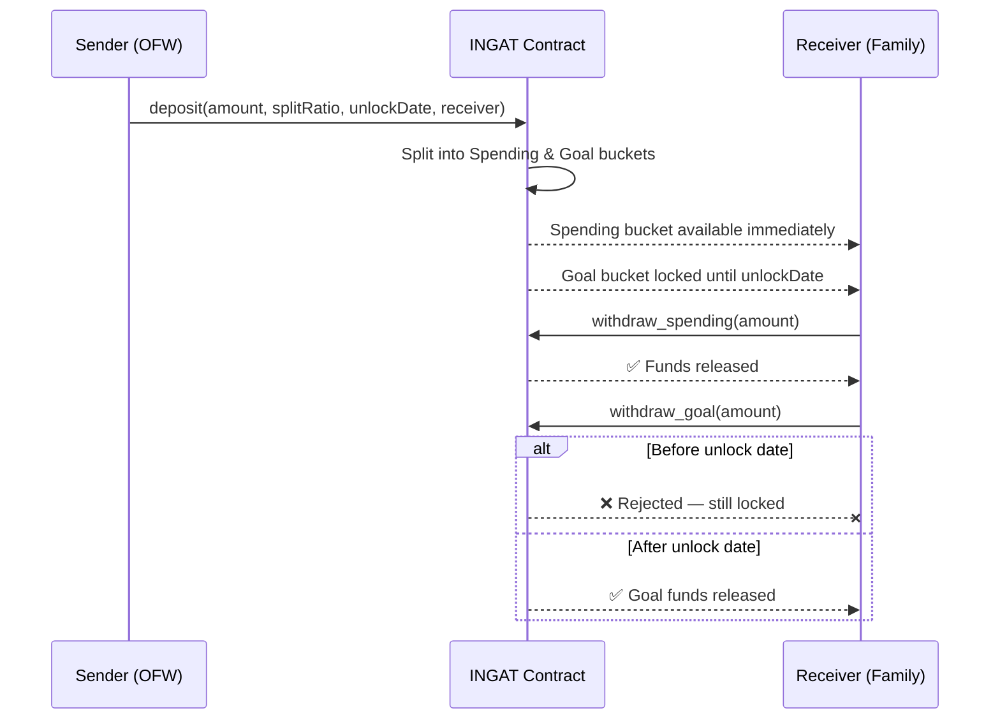
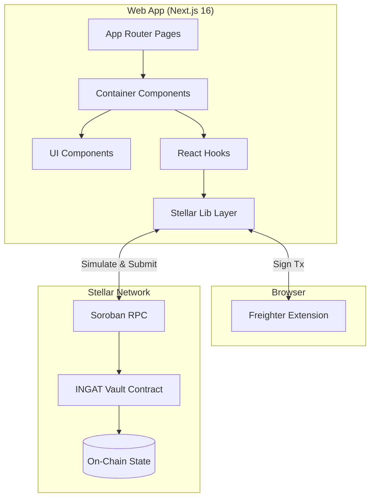
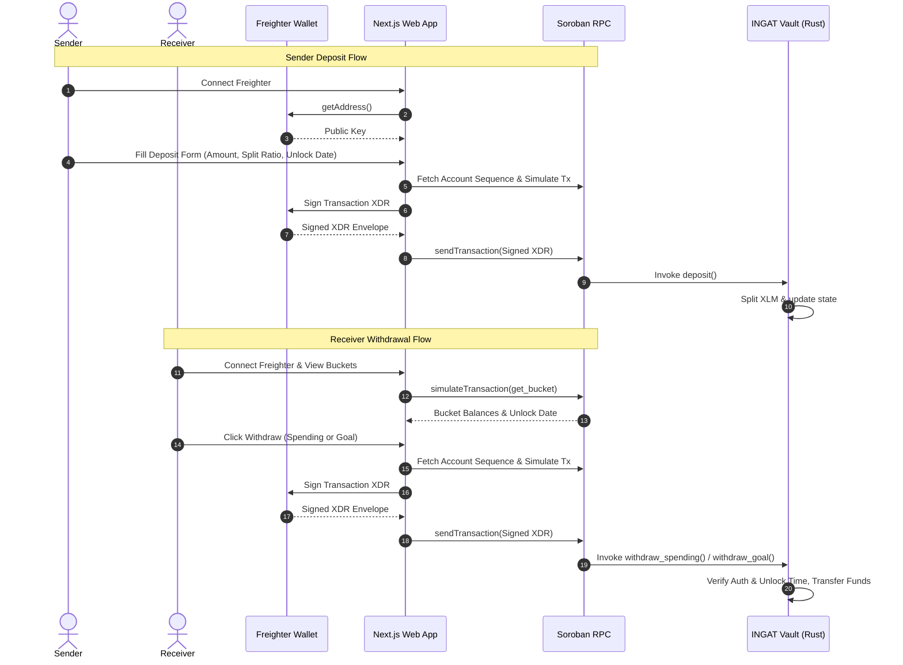
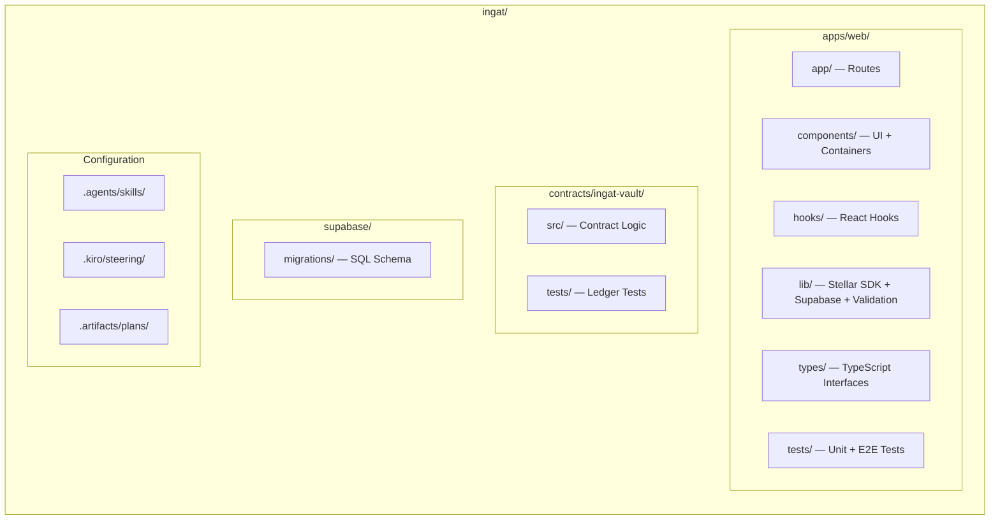
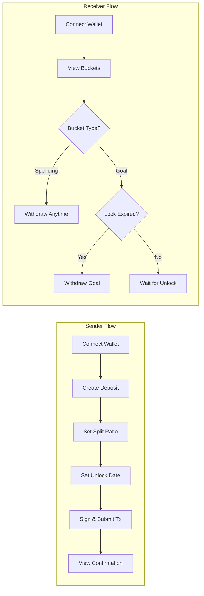
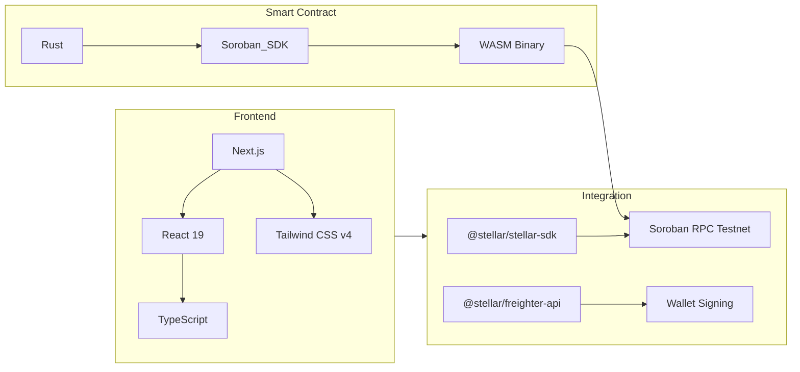

# INGAT — Income Guardianship & Allocation Tool

[](https://github.com/deveramartin/INGAT/actions/workflows/ci.yml)
[](https://github.com/deveramartin/INGAT/actions/workflows/deploy.yml)
[](https://ingat-ten.vercel.app)
[](https://stellar.org)
[](https://soroban.stellar.org)
[](https://crates.io/crates/soroban-sdk)
[](https://nextjs.org)
[](https://react.dev)
[](https://typescriptlang.org)
[](https://tailwindcss.com)
[](https://supabase.com)
[](https://www.rust-lang.org)
[](./LICENSE.md)
[](https://soroban-testnet.stellar.org)
[](./docs/deployments.md)
[](#)

---

**INGAT** ("Take care" in Filipino, as in *"Ingat sa biyahe, ingat din sa padala"*) is a decentralized split-remittance protocol built on Stellar and Soroban. It empowers Overseas Filipino Workers (OFWs) to send remittances with programmable on-chain constraints — automatically dividing funds between immediately spendable cash and locked savings goals. This project supports **individual multi-bucket tracking**, meaning every transaction forms its own unique set of spending and goal cards, preserving separate unlock times and showing sender details on each card.

---

## The Problem & The Solution

### The Problem: Lack of Remittance Guardianship
Overseas Filipino Workers (OFWs) send remittances back to their families as a single lump-sum transfer. Once the funds arrive, the sender has no control or visibility over how they are allocated. Long-term, high-priority savings goals—such as tuition fees, emergency reserves, or housing payments—frequently get absorbed into immediate, everyday daily spending. 

Because there is no technical boundary separating "money to live on" from "money to protect," families must rely solely on manual budgeting discipline. Due to distance and lack of programmatic enforcement, this trust often breaks down, resulting in financial insecurity and family tension.

### The Solution: On-Chain Split-Remittances
**INGAT** ("take care" in Tagalog) solves this by introducing programmable, trustless split-remittances powered by Stellar and Soroban. 
When a sender initiates a deposit, a Soroban smart contract automatically and instantly partitions the incoming native XLM funds into two secure on-chain buckets based on the sender's configured ratio:
- **Spending Bucket**: Readily accessible by the receiver for day-to-day household expenses.
- **Goal Bucket**: Secured and locked on-chain until a sender-defined future unlock date.

By moving the boundary of custody and lock enforcement directly onto the blockchain, INGAT eliminates the need for interpersonal friction and guarantees that savings goals remain untouched until they are mature.

---

## How It Works



---

## Architecture



---

## Stellar & Soroban Integration

INGAT is engineered to run entirely on the **Stellar Testnet** using modern Soroban smart contract patterns and frontend SDKs.

- **Deployed Contract ID**: `CCQGNVUCCAO6WNBXEHT3ZMPB5L57HZJLBIGPY27VSLJMTLVTZJUUINEQ` — [View on Stellar Lab](https://lab.stellar.org/r/testnet/contract/CCQGNVUCCAO6WNBXEHT3ZMPB5L57HZJLBIGPY27VSLJMTLVTZJUUINEQ)
- **Native XLM Token (SAC)**: `CDLZFC3SYJYDZT7K67VZ75HPJVIEUVNIXF47ZG2FB2RMQQVU2HHGCYSC`



### Integration Details

1. **Freighter Wallet Connect ([@stellar/freighter-api](https://www.npmjs.com/package/@stellar/freighter-api))**
   - Implements `getAddress()` to retrieve the active user's Stellar public key.
   - Detects wallet presence via `isConnected()`.
   - Utilizes `signTransaction(xdr, { networkPassphrase })` to sign transaction envelopes client-side, ensuring user secret keys never leave the wallet extension.

2. **Transaction Building & Simulation ([@stellar/stellar-sdk](https://www.npmjs.com/package/@stellar/stellar-sdk))**
   - Retrieves the sender/receiver's latest account state (sequence number) from Soroban RPC via `server.getAccount(address)`.
   - Uses `TransactionBuilder` to construct transaction envelopes calling the smart contract functions (`deposit`, `withdraw_spending`, `withdraw_goal`).
   - Simulates transactions via `server.simulateTransaction(tx)` to compute precise gas limits, resource footprints, and fee structures, and uses `rpc.assembleTransaction(tx, simulation)` to finalize the envelope before signature request.

3. **On-Chain Queries (No-Database Architecture)**
   - To show bucket states in real-time, the frontend builds a dummy transaction with a read-only `get_bucket(receiver)` contract invocation.
   - It simulates the call via `server.simulateTransaction(tx)` and decodes the return value via `scValToNative(retval)` to read balances and lock times.
   - The Stellar ledger serves as the single source of truth for **balances and lock state**. Transaction history is persisted to Supabase for cross-device, permanent access.

4. **Soroban Smart Contract (Rust)**
   - Built using the `soroban-sdk` and compiles to a secure WASM binary.
   - Implements `require_auth()` verification to guarantee only the authorized receiver can withdraw funds.
   - Integrates with Stellar's standard token contract interface (`token::Client`) to execute transfer operations for deposits and withdrawals.
   - Leverages `env.ledger().timestamp()` to strictly enforce the temporal lock on the Goal Bucket, rejecting any withdrawal attempts prior to the unlock date at the blockchain consensus level.
   - Emits structured events (`deposit`, `withdraw`) for off-chain indexing and tracking.

---

## Key Features

| Feature | Description |
|---------|-------------|
| **On-Chain Splits** | Instantly partition deposits into Spending & Goal buckets by user-defined percentages |
| **Goal Lock Protection** | Lock the Goal bucket on-chain until the sender-specified release date |
| **Freighter Integration** | Seamless wallet connect and transaction signing via Freighter extension |
| **Supabase Persistence** | Transaction history persisted off-chain for cross-device, permanent access |
| **Glassmorphic Dashboard** | Responsive, warm-toned UI built with Manrope font and modern design |
| **Soroban Smart Contract** | Gas-efficient Rust contract with state leases, TTL extensions, and 7-decimal precision |

---

## Project Structure



```
ingat/
├── apps/web/                   # Next.js 16 App Router Frontend
│   ├── app/                    # Route entries (landing, sender, receiver)
│   ├── components/             # Containers (stateful) + UI (presentational)
│   ├── hooks/                  # Freighter & Soroban React hooks
│   ├── lib/                    # Stellar client, Supabase client, Freighter wrappers, validation
│   ├── tests/                  # Test suite
│   │   ├── unit/              # Jest unit tests (components, hooks, lib)
│   │   └── e2e/               # Playwright end-to-end tests
│   ├── context/                # WalletContext provider
│   └── types/                  # TypeScript interface models
├── contracts/ingat-vault/      # Soroban Smart Contract (Rust)
│   ├── src/                    # Vault split & withdraw logic
│   └── tests/                  # Time-manipulated simulated ledger tests
├── supabase/                   # Database layer
│   └── migrations/             # SQL migrations for transaction persistence
├── .agents/                    # AI agent skill documentation
├── .kiro/                      # Steering docs (product, tech, structure)
└── .artifacts/                 # Engineering plans & bug fix logs
```

---

## Getting Started

### Prerequisites

| Tool | Version | Purpose |
|------|---------|---------|
| [Rust & Cargo](https://rustup.rs/) | Edition 2021 | Smart contract compilation |
| [Node.js](https://nodejs.org/) | v20+ | Frontend development |
| [Freighter Wallet](https://www.freighter.app/) | Latest | Browser wallet extension |

### Installation

```bash
# Clone the repository
git clone https://github.com/deveramartin/INGAT.git
cd INGAT

# Install workspace dependencies (from root)
npm install
```

---

## Development

### Smart Contract (`contracts/ingat-vault`)

```bash
# Run unit tests (time-manipulation, split logic, TTL extensions)
npm run contract:test

# Build optimized WASM
npm run contract:build

# Clean build artifacts
npm run contract:clean
```

### Web Frontend (`apps/web`)

```bash
# Start development server (Turbopack)
npm run dev

# Production build with TypeScript validation
npm run build

# Lint check
npm run lint
```

### Testing

```bash
# Run all unit tests (Jest + React Testing Library)
npm test

# Run unit tests in watch mode
npm run test --workspace=web -- --watch

# Run E2E tests (Playwright — requires dev server or builds one)
npm run test:e2e --workspace=web
```

Unit tests cover: validation logic, formatting utilities, price helpers, React hooks (useDeposit, useWithdraw), and UI components (ConnectWalletButton, ErrorBanner).

E2E tests cover: landing page navigation, sender flow pages, and receiver flow pages.

>  Run all commands from the **repo root**. This is an npm workspace — do not `cd apps/web`.

---

## User Flows



---

## Tech Stack



---

## Engineering Phases

| Phase | Description | Status |
|:-----:|-------------|:------:|
| 1 | Contract Core — Soroban logic, Cargo workspace, unit tests | ✅ Complete |
| 2 | Wallet & Sender Flow — connection, hooks, deposit form | ✅ Complete |
| 3 | Receiver Flow — bucket cards, unlock timers, withdrawals | ✅ Complete |
| 4 | Polish & Demo — type checks, build validation, clean layouts | ✅ Complete |

---

## Design Principles

- **Contract is Source of Truth for Balances** — On-chain bucket state (spending/goal balances, lock dates) is the authoritative source.
- **Supabase for Transaction History** — All deposit and withdrawal records are persisted to Supabase after blockchain confirmation, providing cross-device permanent history.
- **Two Roles Only** — Sender and Receiver. No admin/approver/auditor.
- **Warm & Trustworthy** — Banking-app clarity, not crypto-trading neon. Filipino identity in color palette.
- **7-Decimal Precision** — All Stellar amounts handled with full stroops precision.
- **Testnet First** — All development targets Stellar Testnet exclusively.

---

## Contributing

See [AGENTS.md](./AGENTS.md) for architecture conventions, coding rules, and the agent steering system.

---

## License

This project is licensed under the MIT License — see [LICENSE.md](./LICENSE.md) for details.
