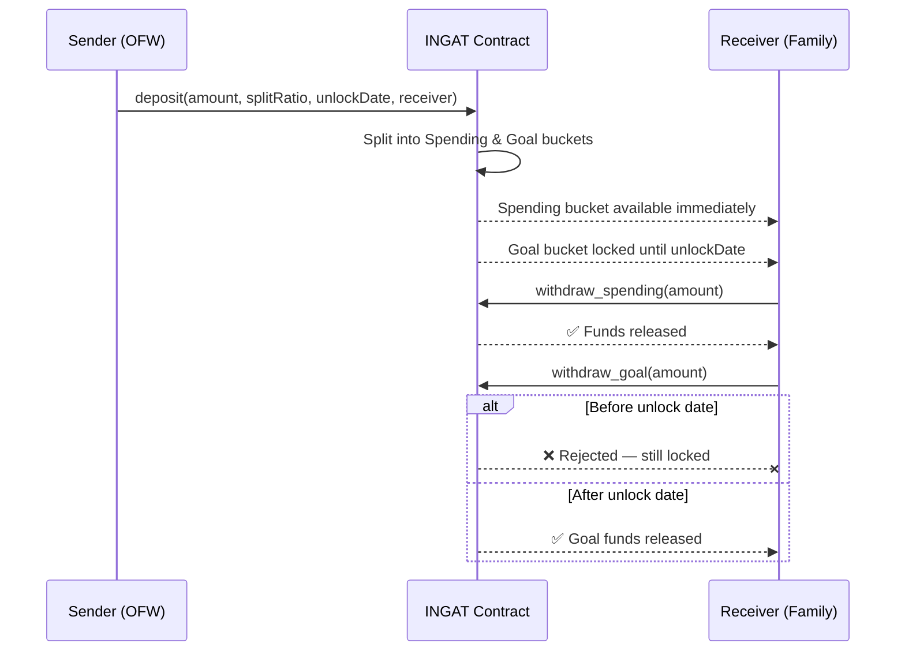
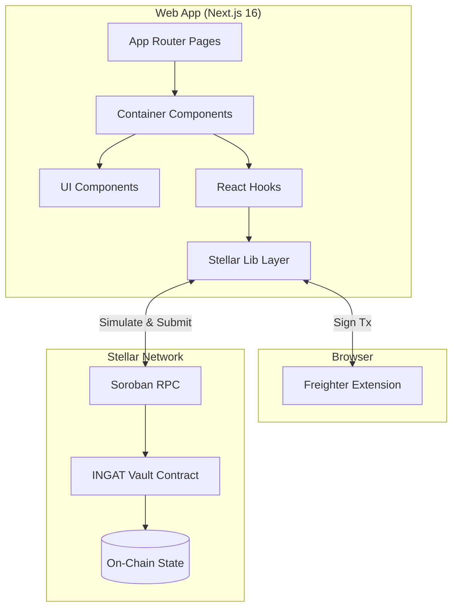
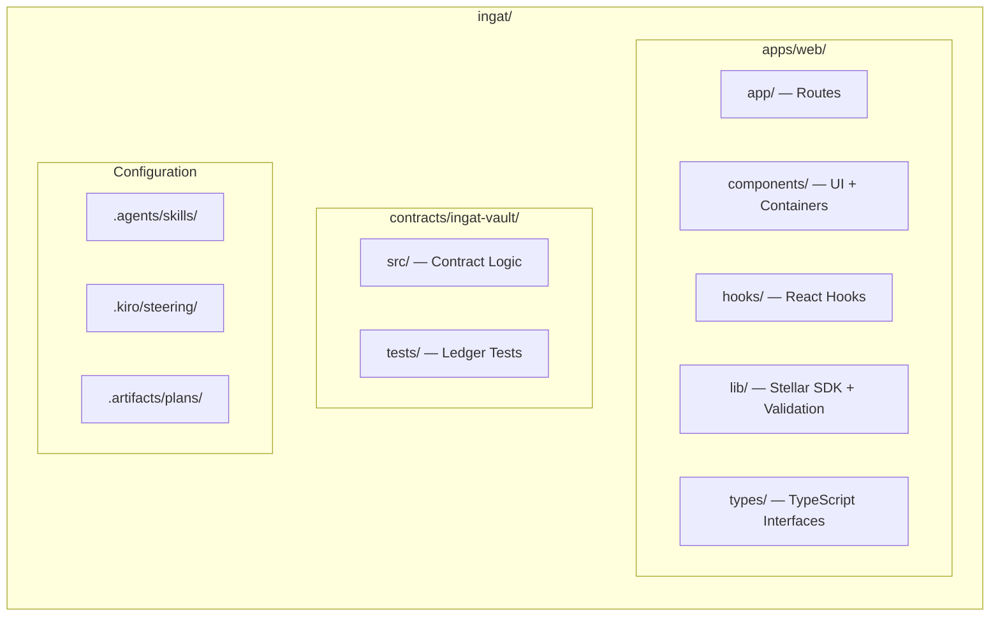
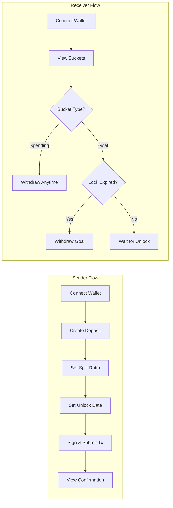
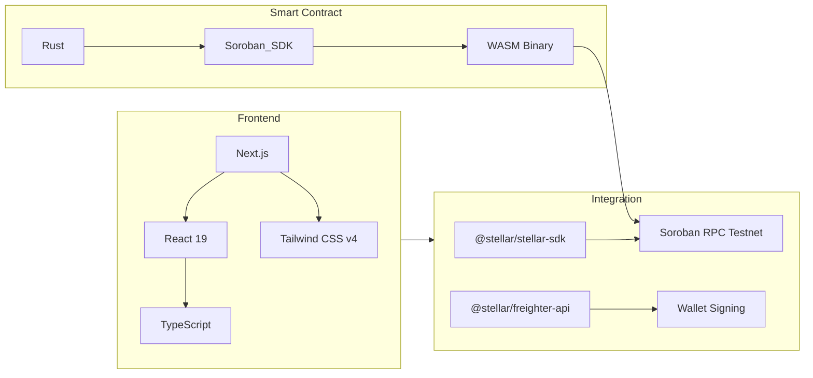

# INGAT — Stellar/Soroban Split-Remittance Protocol

[](https://stellar.org)
[](https://soroban.stellar.org)
[](https://nextjs.org)
[](https://typescriptlang.org)
[](https://tailwindcss.com)
[](https://www.rust-lang.org)
[](./LICENSE.md)
[](https://soroban-testnet.stellar.org)

---

**INGAT** ("Take care" in Filipino, as in *"Ingat sa biyahe, ingat din sa padala"*) is a decentralized split-remittance protocol built on Stellar and Soroban. It empowers Overseas Filipino Workers (OFWs) to send remittances with programmable on-chain constraints — automatically dividing funds between immediately spendable cash and locked savings goals to prevent impulse spending and ensure financial resilience.

---

## How It Works



---

## Architecture



---

## Key Features

| Feature | Description |
|---------|-------------|
| 🔀 **On-Chain Splits** | Instantly partition deposits into Spending & Goal buckets by user-defined percentages |
| 🔒 **Goal Lock Protection** | Lock the Goal bucket on-chain until the sender-specified release date |
| 👛 **Freighter Integration** | Seamless wallet connect and transaction signing via Freighter extension |
| 🎨 **Glassmorphic Dashboard** | Responsive, warm-toned UI built with Manrope font and modern design |
| ⚡ **Soroban Smart Contract** | Gas-efficient Rust contract with state leases, TTL extensions, and 7-decimal precision |

---

## Project Structure



```
ingat/
├── apps/web/                   # Next.js 16 App Router Frontend
│   ├── app/                    # Route entries (landing, sender, receiver)
│   ├── components/             # Containers (stateful) + UI (presentational)
│   ├── hooks/                  # Freighter & Soroban React hooks
│   ├── lib/                    # Stellar client, Freighter wrappers, validation
│   ├── context/                # WalletContext provider
│   └── types/                  # TypeScript interface models
├── contracts/ingat-vault/      # Soroban Smart Contract (Rust)
│   ├── src/                    # Vault split & withdraw logic
│   └── tests/                  # Time-manipulated simulated ledger tests
├── .agents/                    # AI agent skill documentation
├── .kiro/                      # Steering docs (product, tech, structure)
└── .artifacts/                 # Engineering plans & bug fix logs
```

---

## Getting Started

### Prerequisites

| Tool | Version | Purpose |
|------|---------|---------|
| [Rust & Cargo](https://rustup.rs/) | Edition 2021 | Smart contract compilation |
| [Node.js](https://nodejs.org/) | v20+ | Frontend development |
| [Freighter Wallet](https://www.freighter.app/) | Latest | Browser wallet extension |

### Installation

```bash
# Clone the repository
git clone https://github.com/your-org/ingat.git
cd ingat

# Install workspace dependencies (from root)
npm install
```

---

## Development

### Smart Contract (`contracts/ingat-vault`)

```bash
# Run unit tests (time-manipulation, split logic, TTL extensions)
npm run contract:test

# Build optimized WASM
npm run contract:build

# Clean build artifacts
npm run contract:clean
```

### Web Frontend (`apps/web`)

```bash
# Start development server (Turbopack)
npm run dev

# Production build with TypeScript validation
npm run build

# Lint check
npm run lint
```

> ⚠️ Run all commands from the **repo root**. This is an npm workspace — do not `cd apps/web`.

---

## User Flows



---

## Tech Stack



---

## Engineering Phases

| Phase | Description | Status |
|:-----:|-------------|:------:|
| 1 | Contract Core — Soroban logic, Cargo workspace, unit tests | ✅ |
| 2 | Wallet & Sender Flow — connection, hooks, deposit form | ✅ |
| 3 | Receiver Flow — bucket cards, unlock timers, withdrawals | ✅ |
| 4 | Polish & Demo — type checks, build validation, clean layouts | ✅ |

---

## Design Principles

- **No Backend** — Contract state is the single source of truth. No databases.
- **Two Roles Only** — Sender and Receiver. No admin/approver/auditor.
- **Warm & Trustworthy** — Banking-app clarity, not crypto-trading neon. Filipino identity in color palette.
- **7-Decimal Precision** — All Stellar amounts handled with full stroops precision.
- **Testnet First** — All development targets Stellar Testnet exclusively.

---

## Contributing

See [AGENTS.md](./AGENTS.md) for architecture conventions, coding rules, and the agent steering system.

---

## License

This project is licensed under the MIT License — see [LICENSE.md](./LICENSE.md) for details.
