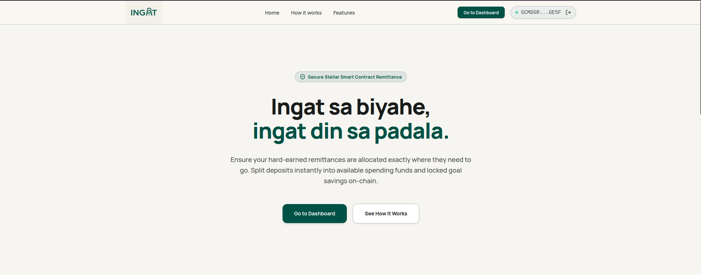
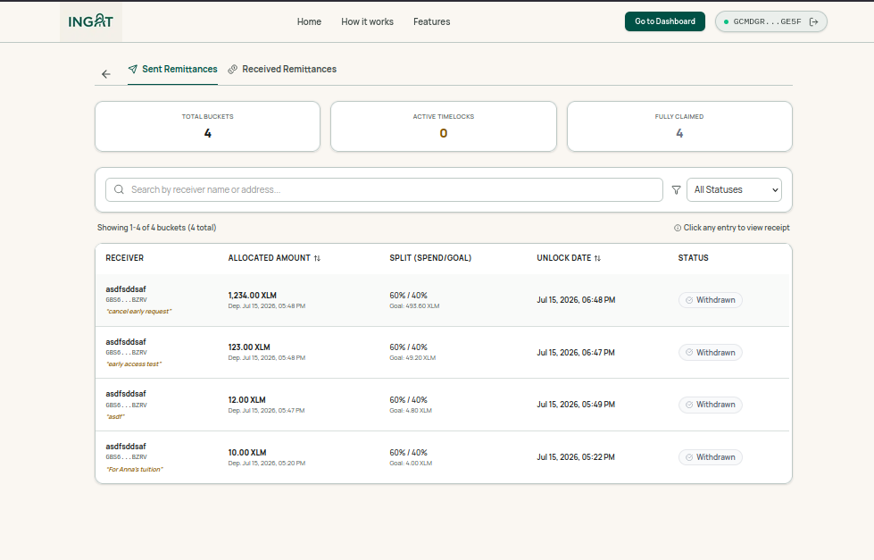
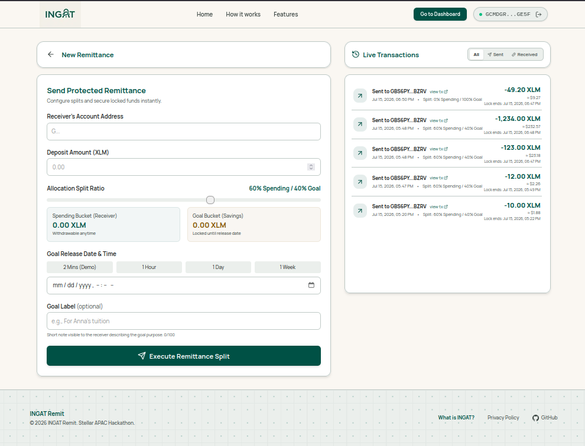

<div align="center">
  

# INGAT

**A Stellar-native split-remittance protocol where family support and savings goals are secure, transparent, and programmable by default.**

 **Track**: Payment & Consumer Applications | [Live App](https://ingat.vercel.app)


</div>

---

**INGAT** (**Income Guardianship & Allocation Tool**) derives its name from the Tagalog word for **"take care"**, embodying the project's core philosophy and tagline: _"Ingat sa biyahe, ingat din sa padala"_ ("take care on the journey, take care of the remittance too"). It is a decentralized split-remittance protocol designed to safeguard hard-earned foreign income by programmatically routing funds to their intended destination on-chain.

## Problem

Overseas Filipino Workers send remittances as a single lump sum, with no way to protect long-term savings goals — tuition, emergency funds, housing — from being absorbed into everyday spending once funds arrive. Because there's no technical boundary between "money to live on" and "money to protect," families rely entirely on manual discipline and trust across distance, which frequently breaks down under financial pressure or guilt-driven requests for more money.

## Proposed Solution

INGAT is a decentralized split-remittance protocol on Stellar/Soroban. When an OFW sends a remittance, a smart contract instantly splits the deposit into a Spending bucket (immediately accessible) and a Goal bucket (locked on-chain until a sender-defined date) — enforced by contract logic, not app permissions, so the lock can't be bypassed even by the sender. A bounded emergency-cooldown mechanism lets receivers request early access for genuine emergencies without making the lock meaningless: requests trigger a notification and a delay window the sender can interrupt, but funds auto-release if the sender doesn't respond, so no one is ever permanently stranded.

## Expected Stellar Integration

- **Soroban smart contract (Rust)** for split-deposit, timelocked withdrawal, and emergency-cooldown logic.
- **Native XLM transfers** via the Stellar token contract interface.
- **Freighter wallet integration** for signing (`@stellar/freighter-api`).
- **Transaction building/simulation** via `@stellar/stellar-sdk` and Soroban RPC.
- **On-chain event emission** for deposit/withdrawal indexing, with off-chain Supabase persistence for transaction history and cross-device access.

## Target Users

Overseas Filipino Workers and their families — specifically households that receive remittances as their primary income source and need a way to protect long-term goals (tuition, emergency reserves) from short-term spending pressure, without requiring either party to be crypto-native.

## Features

- **Programmable Split Remittance**: Instantly divide deposits into a Spending bucket and a Goal bucket using custom ratios. No manual budgeting or mental math required.
- **On-Chain Goal Lock**: Lock goal savings on-chain using smart contracts until a set date. Capital is fully protected and secured by Soroban ledger leases.
- **Emergency Early Access**: Receivers can request emergency early access to locked funds. Senders retain full oversight to approve or reject requests with strict cool-down rules.
- **Freighter Wallet Security**: Connect securely using Freighter Wallet. Sign and verify transactions client-side without exposing private keys or seed phrases.
- **Unified Dashboard & History**: Seamlessly toggle between Sender and Receiver roles. View real-time balances, track lock timers, and review permanent transaction logs.
- **Address Book Aliases**: Assign names to wallet addresses to easily recognize senders and receivers across all transaction logs, active buckets, and early request views.

## Tech Stack

- **Frontend**: Next.js 16, React 19, TypeScript, App Router, Tailwind CSS v4.
- **UI**: Reusable presentational components, Lucide icons.
- **Backend**: Supabase Database, SQL Migrations, Row Level Security (RLS) policies.
- **Blockchain**: Stellar, Soroban, Horizon, `@stellar/stellar-sdk`.
- **Wallets**: Freighter Wallet, `@stellar/freighter-api`.
- **Smart contracts**: Rust, `soroban-sdk`.

---

## Getting Started

### Prerequisites

- Node.js `>=20`
- Rust toolchain
- Stellar CLI
- Freighter Wallet browser extension

### Installation

1. Clone the repository:
   ```bash
    git clone https://github.com/IAmHaiel/INGAT.git
    cd INGAT
   ```
2. Install workspace dependencies:
   ```bash
   npm install
   ```

### Local Development

1. Configure environment variables inside `apps/web/.env.local`.
2. Start the Turbopack dev server:
   ```bash
   npm run dev
   ```
   The web app runs on `http://localhost:3000`.

### Useful Commands

```bash
# Build the production bundle
npm run build

# Run linting
npm run lint

# Compile smart contracts to WASM
npm run contract:build

# Run Rust unit tests
npm run contract:test
```

---

## Testnet Configuration

- **Network**: Stellar Testnet
- **Contract ID**: [`CBI7CWIQOV2T63LB3XMWQJL52IMJGPO6LMSU2XMZHG2SD3JKH47VD42Z`](https://stellar.expert/explorer/testnet/contract/CBI7CWIQOV2T63LB3XMWQJL52IMJGPO6LMSU2XMZHG2SD3JKH47VD42Z)
- **Native SAC Token**: [`CDLZFC3SYJYDZT7K67VZ75HPJVIEUVNIXF47ZG2FB2RMQQVU2HHGCYSC`](https://stellar.expert/explorer/testnet/contract/CDLZFC3SYJYDZT7K67VZ75HPJVIEUVNIXF47ZG2FB2RMQQVU2HHGCYSC)

---

## Screenshots

| Landing Page |
| --- |
|  |

| Sender Dashboard | Receiver Dashboard |
| --- | --- |
| .png>) | .png>) |

| Transaction & Allocation History | Send Remittance Form |
| --- | --- |
|  |  |

---

## Team

- Fitzjaymar Jude Martin
- James Miguel Galgana
- John Michael Garcia
- John Mikhail Angelo Reveche
- Vince Neil Madeja

---

## License

MIT
